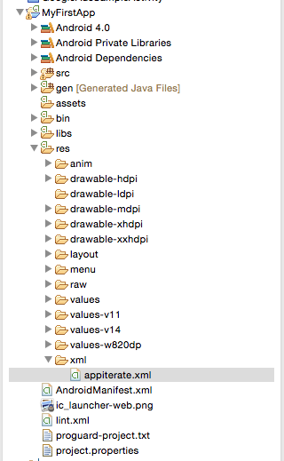

# Android SDK - API Documentation

## SDK setup

Download the [Android SDK](http://appiterate.com/android/latest)

### Copy Files

* Copy `appiteratesdk.jar` to project's lib folder and add its path in your build path
* Copy `httpmime` and `gson` library from the jar to project's lib folder if not already present in the project.

### Create settings file

Create `appiterate.xml` in project's resources in xml folder



### Strings in appiterate.xml

```XML
<appiterate>
    <appkey>{{APP_KEY}}</appkey>
    <debug>true</debug>
    <variables>
        <key>variable1</key>
        <key>variable2</key>
</appiterate>
```

* `APP_KEY`: Retrieve your application key from the
<a href="http://dashboard.appiterate.com" target="_blank">dashboard</a>
* debug: set this to 'true' during development and 'false' for production
* variables: variables you will use for DDT testing

### Adding Required Permission in AndroidManifest.xml

```XML
<uses-permission android:name="android.permission.WRITE_EXTERNAL_STORAGE"/>
<uses-permission android:name="android.permission.ACCESS_NETWORK_STATE"/>
<uses-permission android:name="android.permission.INTERNET"/>
<uses-permission android:name="android.permission.ACCESS_COARSE_LOCATION" />
<uses-permission android:name="android.permission.ACCESS_FINE_LOCATION" />
```

### Initiate SDK

Call the `AppIterate.oncreate(Activity activity)` method inside the `onCreate(Bundle savedInstancestate)` method of your application's main activity after calling `setContentView()`. As a best practice you should do this for all activities of your application.

```JAVA
@Override
protected void onCreate(Bundle savedInstancestate) {
    super.onCreate(savedInstanceState);
    setContentView(R.layout.activity_main);
    // your code..
    AppIterate.oncreate(this);
    // rest of your code
}
```

### Push Notifications

1. Obtain the `Project Number` for your application from your [Google Developers Console](https://cloud.google.com/console). Follow the instructions [here](http://developer.android.com/google/gcm/gs.html#create-proj) if you want to create a new project.

2. Obtain the `Server API key` for your application. Follow the instructions [here](http://developer.android.com/google/gcm/gs.html#access-key) if you do not have one.

3. Go to the SDK Setup page on the [dashboard](http://dashboard.appiterate.com) and upload the `Server API key`.

4. Register the device with AppIterate using the `GCM registration ID`. Follow the instructions [here](http://developer.android.com/google/gcm/client.html#sample-register) to get the registration ID for a device.

```JAVA
@Override
protected void onCreate(Bundle savedInstanceState) {
    super.onCreate(savedInstanceState);
    setContentView(R.layout.activity_main);
    AppIterate.oncreate(this);

    String regId = getGCMToken();   // returns the GCM Registration ID of the device
    AppIterate.setGcmToken(this, regId);    // register device with AppIterate
}
```

* Additionally you can track received and viewed push notifications. (AppIterate tracks these automatically too)

```JAVA
AppIterate.track(getApplicationContext(), "your-event-name-for-recieve");
```

```JAVA
AppIterate.track(getApplicationContext(), "your-event-name-for-view");
```

### In-App Messages

* In-App Messages are bound to a particlar `goal`. Whenever a `goal` is tracked associated In-App Messages are triggered.
* To trigger an In-App Message for a particular `goal` use the following code.

```JAVA
AppIterate.track(Context context, String goalId, TestCallback_inapp callbackObject)
```

* Where
    * `context`: Context of the Activity.
    * `goalId`: Goal identifier for the In-App Message.
    * `callbackObject`: Callback object for the call to actions in the In-App Message.

```java
callbackObject = new TestCallback_inapp() {
    public void def(JSONObject object) {
        // do something with your callback
    }
}
```

* Add the following lines in the `onDestroy` method of the Activities in which In-App Messages will be displayed

```JAVA
@Override
protected void onDestroy() {
    AppIterate.onDestroy(this);
}
```


### Data Driven Tests

Create a test on the dashboard. Keep a note of Short name, which you mention at the time of creating a test. To retrieve parameters defined on your "Test Details" page, use getValue function defined in our SDK.

```JAVA
getValue(Context context, String variableName, String defaultValue) : String
```

### WYSIWYG Tests

* A WYSIWYG test uses a screen uploaded from your application. To upload a screen override the `onCreateOptionsMenu` and `onOptionsItemSelected` method of the Activity.

```JAVA
@Override
public boolean onCreateOptionsMenu(Menu menu) {
    AppIterate.onOptionsMenu(this, menu);
    return true;
}

@Override
public boolean onOptionsItemSelected(MenuItem item) {
    return AppIterate.onOptionsItemSelected(this, item);
}
```

* If you are using a device which does not have a `Menu` buttton, you can invoke the above menu on double tap.

```java
@Override
public boolean dispatchTouchEvent(MotionEvent event) {
    super.dispatchTouchEvent(event);
    AppIterate.getGestureDetector().onTouchEvent(event);
    return true;
}
```

* This process needs to be repeated for all `Activities` where WYSIWYG tests are required.

* Launch the application and tap the `Menu` button (or double tap). Tap `Appiterate - Upload Screen Data` to upload the current `Activity` to AppIterate servers.

* `Ensure` to replace the implementation of `onCreateOptionsMenu` and `onOptionsItemSelected` with your applications logic after uploading the screens.

* You can now create WYSIWYG tests on the [dasboard](http://dashboard.appiterate.com).
    * Select the screen you want to test on.
    * Create multiple variations of this screen.
    * You can verify these variation on your `test devices`.
    * In order to see the variation on the your `test device` press the `Menu `button (or double tap) and tap on `Refresh Variation`.
