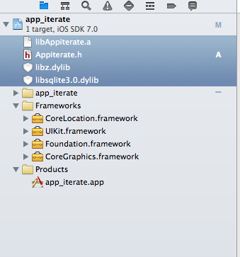

# iOS SDK - API Documentation

## SDK setup

* Download the [iOS SDK](http://dashboard.appiterate.com)
* The SDK comes with two files: `Appiterate.h` and `Appiterate.a`. Include both of them in your project.
* Add the following frameworks to your project:
    * libsqlite3.0.dylib
    * ibz.dylib
    * CoreLocation.framework
    * Security.framework
* Add the following compier flag:
    * ObjC



## Initialize SDK

* Add the following lines to the `AppDelegate` of the application.

```objective-c
[Appiterate initAppiterate:@"APP_KEY" isDebug:YES]
```

* The SDK must be initalized before initializing application window and user interfaces.
* `APP_KEY`: Retrieve your application key from the
<a href="http://dashboard.appiterate.com" target="_blank">dashboard</a>.
* isDebug: set this to `YES` during development and `NO` for production.

```objective-c
-(BOOL)application:(UIApplication *)application
 didFinishLaunchingWithOptions:(NSDictionary *)launchOptions
 {
   //Appiterate SDK Initialization
   [Appiterate initAppiterate:@"b62d5a2057f21e5b465e5ccadc1c8f72" isDebug:YES];

   self.window = [[[UIWindow alloc] initWithFrame:[[UIScreenmainScreen] bounds]]autorelease];

   // Override point for customization after application launch.
   self.viewController = [[[ViewController alloc]
   initWithNibName:@"ViewController" bundle:nil] autorelease];
   self.window.rootViewController = self.viewController;

   [self.window makeKeyAndVisible];

   return YES;
 }
```

## Push Notifications

* Upload your applications' SSL certificate and key files (*.pem) to AppIterate servers from the [dashboard](http://dashboard.appiterate.com).
* Register the deives with the APNS service for push notifications

```objective-c
//Send received push token to our SDK
- (void)application:(UIApplication *)app didRegisterForRemoteNotificationsWithDeviceToken:(NSData *)devToken {
  [Appiterate sendPushToken:devToken];
  // must to receive push notifications via Appiterate dashboard
}

//Send received push message to our SDK
-(void)application:(UIApplication *)application didReceiveRemoteNotification:(NSDictionary *)userInfo {
  [Appiterate application:application receivedRemoteNotification:userInfo];
  //add this line to enable us to send track data for analytics
}
```

## In-App Messages

In order to integrate an in-app message, create a message from dashboard and attach a goal to it. While creating an in-app message, user has two choices, either specify a web url which will be opened in safari once user clicks message or specify key-value pairs which user gets as dictionary in callback data.

```objective-c
[Appiterate trackGoal:@"nknj3kn" onScreen:self withCallback:nil];
```

```objective-c
void (^callback)(NSDictionary*) = ^(NSDictionary * data) {
  NSString * val1 = [data objectForKey:@"key1"];
  NSLog(@"val1:%@",val1);
  // use values received
};
[Appiterate trackGoal:@"{{GOAL_ID}}" onScreen:self withCallback:callback];
```